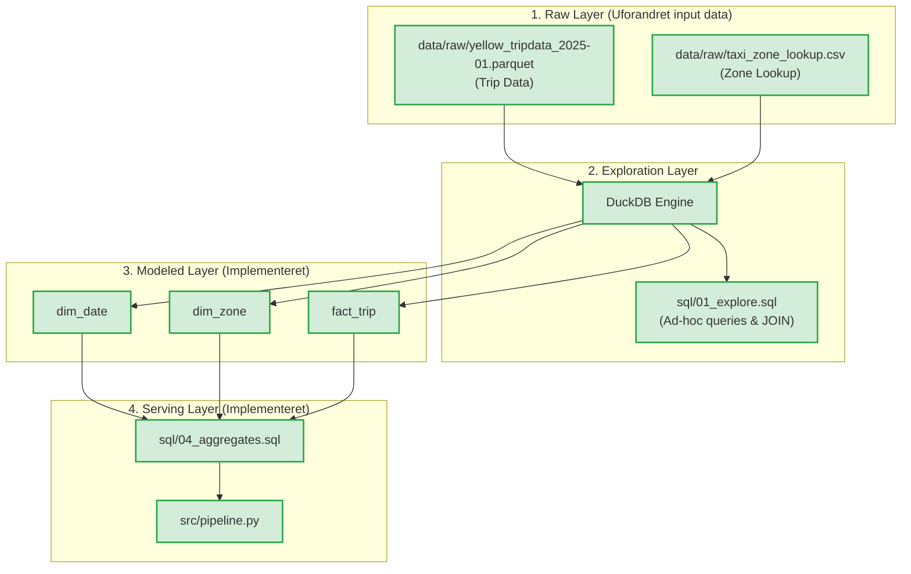
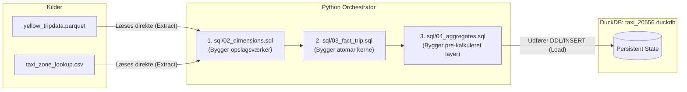
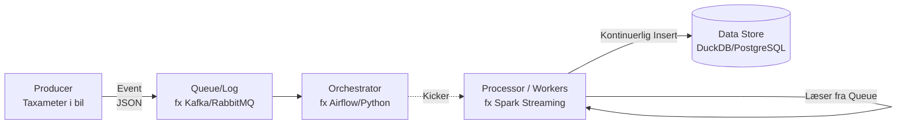
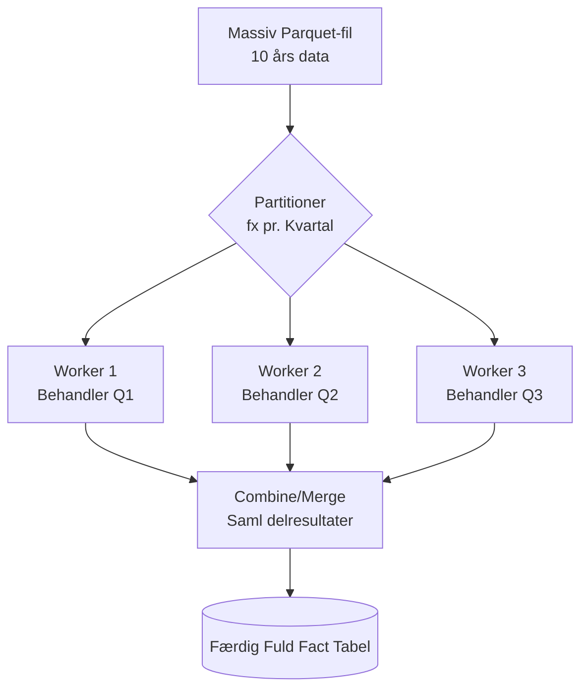

# Arkitektur

**Version 1.0 · Elevskabelon**

## Indhold

1. [Dag 01 – Data og Analysebehov](#1-dag-01--data-og-analysebehov)
2. [Dag 02 – Arkitekturskitse og Datamodel](#2-dag-02--arkitekturskitse-og-datamodel)
3. [Dag 03 – Databehandling, Aggregate og Genskabelse](#3-dag-03--databehandling-aggregate-og-genskabelse)
4. [Dag 04 – Processing og Pipeline](#4-dag-04--processing-og-pipeline)

---

## 1. Dag 01 – Data og Analysebehov

### Data

**Yellow Taxi:** Én rå række ser ud til at repræsentere:
Én enkelt registreret taxitur i New York City (enten påbegyndt, gennemført eller afbrudt) opsamlet af et af de autoriserede taxametersystemer i løbet af januar 2025.

**Taxi Zone Lookup:** Én række repræsenterer:
Én geografisk afgrænset taxazone defineret af NYC Taxi & Limousine Commission (TLC). Filen fungerer som en stamdatatabel, der forbinder et nummermæssigt `LocationID` med navnet på en bydel (`Borough`), et zonenavn (`Zone`) og en servicetype (`service_zone`).

### Feltforklaringer og observationer

1. **`tpep_pickup_datetime`**
   - **Betydning & Enhed:** Dato og klokkeslæt (YYYY-MM-DD HH:MM:SS) for hvornår taxameteret blev slået til ved turens start.
2. **`trip_distance`**
   - **Betydning & Enhed:** Den samlede kørte turafstand i miles målt af køretøjets taxameter (1 mile ≈ 1,609 km).
3. **`PULocationID`**
   - **Betydning & Enhed:** TLC Taxi Zone ID for afhentningsstedet (Pickup Location). Heltals-ID fra 1 til 265, som fungerer som fremmednøgle til `taxi_zone_lookup.csv`.
4. **`payment_type`**
   - **Betydning & Enhed:** Numerisk kode for betalingsform (`1` = Credit card, `2` = Cash, `3` = No charge, `4` = Dispute, `5` = Unknown, `6` = Voided trip).
5. **`total_amount`**
   - **Betydning & Enhed:** Det samlede beløb i US Dollars ($), som passageren opkræves. Inkluderer grundtakst, drikkepenge, tillæg og skat.

**Uventede værdier i raw-data:**

- **Skæve tidsstempler:** Registreringer fra forkerte årstal (fx 2008 eller 2024), hvilket skyldes fejlkonfigurerede taxametre i enkelte vogne.
- **Negative beløb:** Nogle rækker i `total_amount` har negative værdier, hvilket repræsenterer annullerede ture eller systemkorrektioner.
- **Ukendte zoner:** ID 264 og 265 repræsenterer lokationer, hvor zonen er enten ukendt eller uden for TLC's normale kortlægning.

### Analysebehov

1. **Døgnrytme og spidsbelastningsanalyse:** Hvornår på døgnet udføres der flest afhentninger, og hvordan varierer den gennemsnitlige kørte distance (`trip_distance`) i løbet af døgnets timer?
2. **Regional efterspørgsel og lufthavnsture (bruger Zone Lookup):** Hvilke bydele (`Borough`) genererer flest afhentninger og den højeste gennemsnitlige turpris (`total_amount`), og hvor stor en andel udgør afhentninger fra lufthavnszoner (JFK og LaGuardia)?
3. **Betalingsmønstre og drikkepengeadfærd:** Er der forskel på den gennemsnitlige drikkepengeprocent (`tip_amount` i forhold til `total_amount`) afhængigt af betalingstype (`payment_type`) — f.eks. kreditkort over for kontant betaling?

**Anvendte Kilder (Dag 01):**

- [NYC TLC Data Dictionary](https://www.nyc.gov/assets/tlc/downloads/pdf/data_dictionary_trip_records_yellow.pdf) - Til definition af enheder og talkoder for betalingstype.
- [DuckDB Querying Parquet](https://duckdb.org/docs/current/guides/file_formats/query_parquet) - Læsning af rådata direkte via `read_parquet()`.
- [DuckDB CSV Overview](https://duckdb.org/docs/current/data/csv/overview) - Direkte JOINs på `.csv` filer via `read_csv()`.
- [DuckDB Date Functions](https://duckdb.org/docs/current/sql/functions/date) - Brug af `EXTRACT(HOUR FROM ...)` for at finde døgnrytme.
- [DuckDB Pattern Matching](https://duckdb.org/docs/current/sql/functions/pattern_matching) - Brug af `LIKE '%Airport%'` til lufthavns-identifikation.
- [DuckDB CASE Expressions](https://duckdb.org/docs/current/sql/expressions/case) - Oversættelse af numeriske betalingskoder til tekst.
- [DuckDB Utility Functions](https://duckdb.org/docs/current/sql/functions/utility) - Brug af `NULLIF` for at undgå _Division by Zero_ i drikkepengeprocenten.

---

## 2. Dag 02 – Arkitekturskitse og Datamodel

Nedenstående dataflow illustrerer rejsen fra ustrukturerede inputfiler til aggregerede resultater. Fordi hele pipelinen nu er bygget, er samtlige lag markeret som implementeret. Selve ER-diagrammet (Starchart) for datamodellen findes i `docs/model.md`.

**Anvendte Kilder (Dag 02):**

- [DuckDB CREATE TABLE](https://duckdb.org/docs/current/sql/statements/create_table) - Oprettelse af dimensioner og facts via `CREATE TABLE AS SELECT`.
- [Kimball Group - Dimensional Modeling](https://www.kimballgroup.com/data-warehouse-business-intelligence-resources/kimball-techniques/dimensional-modeling-techniques/) - Anvendt til at designe _Star Schema_ og definere _Role-playing dimensions_ for `dim_date` og `dim_zone`.

---

## 3. Dag 03 – Databehandling, Aggregate og Genskabelse

Her adskiller vi data i tre modenhedslag:

1. **Raw (Originale Data):** `.parquet` og `.csv`. Ligger gemt lokalt og fungerer som "Source of Truth".
2. **Modeled (Afledt Stjerneskema):** `fact_trip`, `dim_date` og `dim_zone`. Data modelleret for at gøre dem relaterbare.
3. **Aggregate (Sammenfattet):** Tabellen `agg_daily_borough_revenue`. Data rullet op til hurtig rapportering.

### Aggregate og informationstab

I `sql/04_aggregates.sql` har vi arbejdet med analysebehovet: _Regional efterspørgsel pr. dag_. Data er rullet sammen i `agg_daily_borough_revenue`.

- **Grain før (i `fact_trip`):** Én række = én specifik taxitur (atomic grain).
- **Grain efter (i aggregate):** Én række = samlet aktivitet for én bestemt bydel på én bestemt dato.
- **Konklusion på kontroller:** Vores duckdb-queries viser, at rækkeantallet reduceres massivt fra ~3,4 mio. til ganske få rækker pr. måned.

**Spørgsmål og datagrundlag:**

- **Kan besvares:** _"Hvad var den totale omsætning i Manhattan d. 5. januar 2025?"_ (Slås direkte op i aggregatet).
- **Kræver mere detaljerede data:** _"Hvad var den gennemsnitlige distance for ture kørt i Manhattan d. 5. januar specifikt kl. 14:00?"_ (Fejler, fordi vi mistede time-detaljen under aggregeringen).

**Beregning af gennemsnit efter aggregering:**
Når vi aggregerer data op, må vi aldrig tage et "gennemsnit af et gennemsnit" pga. forskellig vægtning. Derfor bevarer vi de absolutte measures `SUM(total_amount)` og `COUNT(*)`. For at beregne det rigtige gennemsnit, dividerer vi blot den aggregerede totalsum med det aggregerede antal ture.

### Lagring og platform

- **Valgt Data Store:** Et analytisk Data Warehouse implementeret via DuckDB.
- **Begrundelse:** Adgangsmønsteret kræver lynhurtige aggregeringer af specifikke kolonner over millioner af rækker.
- **Begrænsning:** Lokal DuckDB kører "single node", hvilket begrænser processorkraft og forhindrer mange samtidige skriveoperationer. Et relevant alternativ er Cloud Data Warehouses som BigQuery eller Snowflake.
- **Lakehouse & Ejerskab (Data Mesh):** Vores `.parquet`-filer udgør vores "Data Lake", og DuckDB er vores "Warehouse", hvilket samlet udgør en "Lakehouse" arkitektur. Ifølge Data Mesh principperne bør forretningsdomænet eje datadefinitionerne, mens IT drifter miljøet.

### Bevaring og genskabelse (Rebuild)

| Artefakt                     | Type             | Version / Identifikation           | Retention           | Backup / Rebuild plan                             |
| :--------------------------- | :--------------- | :--------------------------------- | :------------------ | :------------------------------------------------ |
| `yellow_tripdata_...parquet` | Raw              | År-Måned filnavn + SHA256 Checksum | 5 år jf. lovgivning | **Backup etableret.** Uundværlig for Rebuild.     |
| `taxi_zone_lookup.csv`       | Raw              | Download-dato + MD5 Hash           | Løbende             | **Backup etableret.** Nødvendig for historik.     |
| `.sql` og `.py` filer        | Kode / Logik     | Git Commit Hash                    | Uendelig            | **Backup etableret via Git.** Genskaber logikken. |
| `taxi_20556.duckdb`          | Persistent State | Databasefil / Snapshot-dato        | 30 dage             | **Ingen backup.** Rebuildes fra Raw + SQL.        |

**Genskabelsesplan:**
Slettes vores `.duckdb` fil, er Git-historik ikke nok, da Git kun versionerer kode, ikke de 3,4 mio. rækker data. En checksum er blot et fingeraftryk og ikke en backup. For at _rebuilde_ trækkes `.py` og `.sql` scripts fra Git, rå-filerne `.parquet` hentes fra vores eksterne backup, og pipelinen genkøres for at genopbygge _persistent state_.

**Anvendte Kilder:**

- [Kimball Group - Grain](https://www.kimballgroup.com/data-warehouse-business-intelligence-resources/kimball-techniques/dimensional-modeling-techniques/grain/) - Brugt til at argumentere for atomic grain i fact-tabellen, og tab af detaljegrad i aggregate.
- [DuckDB Aggregate Functions](https://duckdb.org/docs/current/sql/functions/aggregates) - Anvendt til at forstå matematikken bag `SUM()` og informationstab.

---

## 4. Dag 04 – Processing og Pipeline

### Den implementerede batch-pipeline

- **Hvorfor `01_explore.sql` ikke er med:** Udforskning er ad-hoc analyse. Vores reproducerbare pipeline skal udelukkende indeholde DDL/DML scripts, der bygger datavarehuset.
- **Afhængigheder og Transaktionssikkerhed (Fail-stop):** Python-scriptet validerer først alle `.sql`-filer. Pipelinen pakker derefter kørslerne ind i en `BEGIN TRANSACTION`. Hvis `04_aggregates.sql` fejler, udløser scriptet `ROLLBACK`. Dette fjerner alt, der blev oprettet i `02` og `03`, så vi aldrig efterlader en korrupt/halv database. Forbindelsen lukkes sikkert via `finally`.

### ETL eller ELT – angiv destinationen

- **Klassifikation:** Dette projekt anvender **ELT** (Extract, Load, Transform).
- **Destination:** Den lokale database-fil (`taxi_20556.duckdb`).
- **Begrundelse:** Vi _extract_ data fra filerne og _loader_ det ind i hukommelsen på DuckDB-motoren. Transformationen sker direkte i DuckDB's engine (via vores SQL). Hvis destinationen derimod var et eksternt system, og vi foretog beregningerne i Python inden aflevering, ville det være ETL.

### Genkørsel og næste batch

- **Genkørsel:** Vores SQL-filer bruger `CREATE TABLE IF NOT EXISTS`. Kørsel 2 fordoblede **ikke** data. Databasen bevarede sit forventede antal rækker (3.475.226 ture).
- **Nyt batch (Februar 2025):**
  Når `yellow_tripdata_2025-02.parquet` lander, ignoreres de nye data, hvis vi beholder `IF NOT EXISTS`.
  _Plan:_ Opdater SQL logik til enten `CREATE OR REPLACE` for en fuld rebuild, eller opsætning af inkrementel indlæsning via `INSERT INTO fact_trip` der udelukkende medtager datoer `> 2025-01-31`. Dette kræver schemas-kontrol og sikring mod primærnøgle-overlap.

### Streamingvariant og ansvar

- **Event time:** I streaming skelnes der mellem Event Time, hvornår turen sluttede i virkeligheden, og Processing Time, hvornår serveren fik beskeden. Forsinkede events kræver styring af 'late arriving facts'.
- **Ansvar:** _Produceren_ udsender kun data. _Queue_ (fx Kafka) er ansvarlig for at sikre beskederne, hvis databasen går ned. _Processoren_ udfører transformationen, mens _Orchestratoren_ udelukkende styrer tidsplaner og overvåger workers (udfører ikke selve SQL-koden).

### Konceptuelt paralleliseringsdesign

- **Udløser:** Hvis løsningen skal håndtere et 10-års historisk dump , måske flere milliarder af rækker, vil en single-thread kørsel ramme en hardware-grænse (RAM/Memory Limit).
- **Løsning:** Behandlingen paralleliseres over flere workers (CPU-kerner eller fysiske servere).

- **Design & Trade-offs:** Partitionering sker via "Måned" eller "Kvartal". Hver worker bygger fact rækker for sin periode. Til sidst samles de via en Merge operation. Et typisk trade-off/problem er _Data Skew_ , hvor én worker fx får en Covid-19 måned med få ture, mens en anden worker overbelastes af juletrafik.

### Implementeret, testet og foreslået

| Element                   | Status                      | Evidens eller næste skridt                              |
| :------------------------ | :-------------------------- | :------------------------------------------------------ |
| Lokal batch-pipeline      | **Implementeret og testet** | `src/pipeline.py` kører uden fejl.                      |
| Genkørsel med samme input | **Implementeret og testet** | Data fordobles ikke (idempotens bekræftet).             |
| Nyt månedligt batch       | **Foreslået**               | Kræver ændring i SQL (inkrementel INSERT).              |
| Streamingvariant          | **Foreslået**               | Arkitektur tegnet. Kræver Queue-infrastruktur.          |
| Parallel behandling       | **Foreslået**               | Arkitektur tegnet. Udløses først ved performance-limit. |

**Anvendte Kilder (Dag 04):**

- [DuckDB Python API - SQL Execution](https://duckdb.org/docs/api/python/sql_execution) - Brugt til syntaks for `extract_statements()` og error-handling.
- [DuckDB Documentation - Transactions](https://duckdb.org/docs/sql/statements/transaction.html) - Anvendt til at sikre Rollback ved fejl under kørslen.

## 5. Presentation Layer & Data Marts (Grafana)

For at gøre vores Data Warehouse tilgængeligt for slutbrugere, har vi etableret et præsentationslag via Grafana (kørende i Docker).
Frem for at Grafana forespørger direkte i vores store millioner-rækkers fact_trip tabel, bygger vi aggregerede udtræk (Data Marts) via DuckDB. Dette sikrer høj ydeevne og lynhurtig indlæsning af dashboards.

Eksempler på aggregater vi stiller til rådighed:

- Geografisk performance: Daglig omsætning fordelt på bydele (Boroughs), hvilket visualiseres som Time Series.
- Tidsmæssig belastning (Peak Hours): Omsætning og antal ture aggregeret på time-niveau for at identificere myldretid og døgnrytmer i New Yorks infrastruktur.
