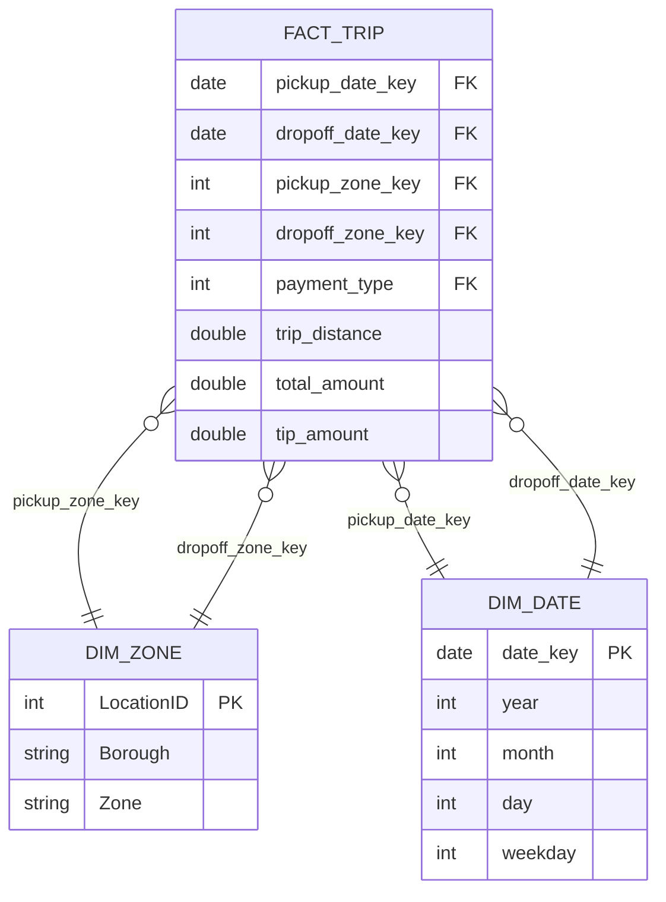

# Datamodel

**Version 1.2 · Elevskabelon**

## Indhold

1. [Første modelskitse](#1-første-modelskitse)
2. [Grain](#2-grain)
3. [Measures og dimensions](#3-measures-og-dimensions)
4. [Relationer og roller](#4-relationer-og-roller)
5. [Modeldiagram](#5-modeldiagram)
6. [Kontroller](#6-kontroller)
7. [Forklaring og kilder](#7-forklaring-og-kilder)

---

# 1. Første modelskitse

Udvalgte analysebehov fra mandag:

1. **Døgnrytme/Spidsbelastning:** Kræver dato/tid, antal afhentninger og kørte miles.
2. **Lufthavnsture og Bydel:** Kræver afhentningszone, bydel (Borough) og omsætning.
3. **Betaling og drikkepenge:** Kræver betalingstype, samlet pris og drikkepengebeløb.

Modelskitse i ord:
Vi har brug for en central tabel for selve taxituren. Denne tabel skal indeholde beløb og afstand (det vi vil regne på) samt "nøgler", der peger ud på hjælpetabeller (dimensioner). Hjælpetabellerne skal beskrive datoerne, zonerne og betalingsformerne.

# 2. Grain

**Hvad repræsenterer én række i `fact_trip`?**

> Én række i `fact_trip` repræsenterer én unik taxitur (gennemført, afbrudt eller påbegyndt) foretaget af en NYC Yellow Taxi.

**Hvorfor passer dette grain?**

> Dette er det lavest mulige detaljeniveau (atomic grain). Ved at bevare én række pr. tur kan vi rulle data op (aggregere) på præcis de niveauer, vi har lyst til (fx pr. time, pr. ugedag, pr. bydel) uden at miste fleksibilitet til at besvare mandagens analysebehov.

# 3. Measures og dimensions

**Vigtigste measures (det vi måler/regner på):**

> `trip_distance` (miles), `total_amount` (omsætning i USD), `tip_amount` (drikkepenge i USD).

**Vigtigste dimensions (det vi filtrerer/grupperer efter):**

> `dim_date` (dato/tid), `dim_zone` (geografi), `dim_payment` (betalingstype).

**Forskellen på measure og dimension:**

> En **measure** er kvantitativ og numerisk (noget der kan summeres eller beregnes gennemsnit af, fx pris). En **dimension** er beskrivende kontekst (hvem, hvad, hvor, hvornår – fx zonenavn eller ugedag).

# 4. Relationer og roller

**Role-playing dimension: `dim_zone`**

> Tabellen `dim_zone` indeholder alle NYC's taxizoner. I `fact_trip` har vi både en `pickup_zone_key` og en `dropoff_zone_key`. Begge disse nøgler peger på den _samme_ dimensionstabel (`dim_zone`), men tabellen spiller to forskellige "roller" (afhentning vs. aflevering) afhængigt af, hvilken nøgle vi joiner på.

**Role-playing dimension: `dim_date`**

> Tilsvarende bruges `dim_date` til at slå datoinformation (ugedag, måned) op for både `pickup_date` og `dropoff_date`. Én dimension, flere roller.

# 5. Modeldiagram

